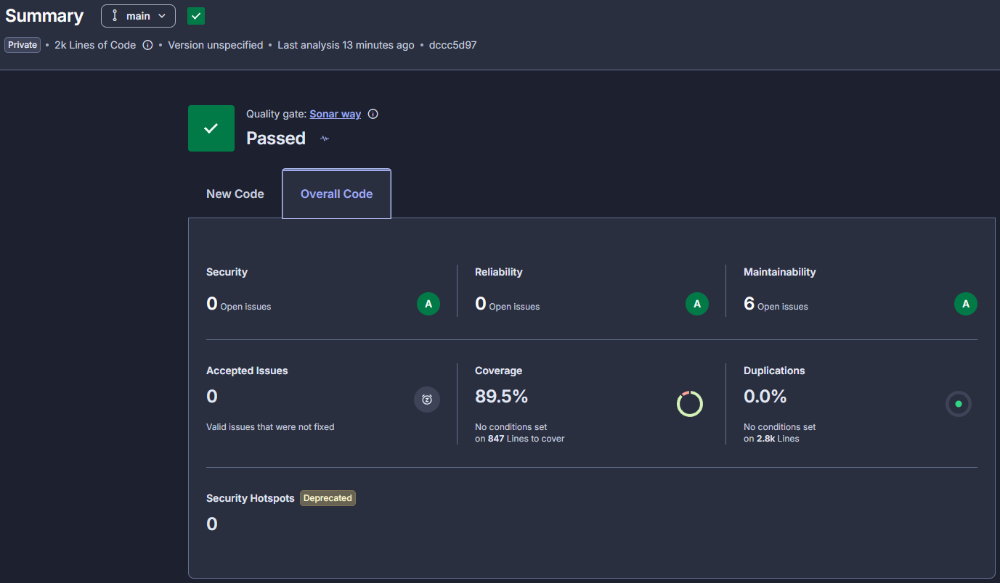

# auto-repair-shop-billing

Microsserviço **billing** do Auto Repair Shop: gera o orçamento a partir da OS já precificada,
coleta a aprovação do cliente por link de e-mail, integra o **Mercado Pago** (preferência de
checkout, webhook e estorno) e publica os eventos de resultado na saga. Kotlin/Ktor sobre
PostgreSQL, com RDS próprio.

## Arquitetura

Comunicação 100% assíncrona (SNS para SQS, envelope do contrato). REST só para o link de
aprovação e o webhook do Mercado Pago. O estado é derivado por serviço (status da `Quote`), sem
orquestrador central.

**Consome** (fila `auto-repair-shop-billing-queue-{env}`, dispatch por `eventType`, ignora o resto):

| eventType | efeito |
|---|---|
| `OrderAwaitingApproval` (de order) | cria a `Quote` priced (persiste `reservationId`), gera token e enfileira `QuoteEmailRequested` |
| `ExecutionFailed` (de execution) | estorna o pagamento via Mercado Pago e marca a `Quote` `REFUNDED` |

**Produz** (tópico `auto-repair-shop-billing-events-{env}`, envelope + attribute `eventType`):

| eventType | gatilho |
|---|---|
| `QuoteEmailRequested` | após criar a Quote (consumido pela Lambda de e-mail, assinatura filtrada) |
| `QuoteApproved` | link `/approve`: preferência criada no MP, leva o `checkoutUrl` ao e-mail |
| `PaymentConfirmed` | webhook MP: pagamento aprovado |
| `QuoteRejected` | link `/decline` |
| `PaymentFailed` | webhook MP: pagamento recusado ou expirado |

O link `/approve` cria a preferência no Mercado Pago, redireciona 302 ao checkout e publica
`QuoteApproved` com o `checkoutUrl`, para que a Lambda de e-mail mande o link de pagamento. É o
caminho durável para quem abandona a aba do checkout.

Fluxo feliz: `OrderAwaitingApproval` → `QuoteEmailRequested` → (cliente aprova → `QuoteApproved`
→ checkout MP) → webhook → `PaymentConfirmed`.

Contrato completo: `auto-repair-shop-infra/docs/saga-event-contract.md`.

### Envelope, idempotência e outbox

- **Envelope** (body): `{ eventId, eventType, eventVersion, occurredAt, payload }`, JSON camelCase,
  dinheiro como decimal. Attribute SNS `eventType` (casa com o `filter_policy` da Lambda de e-mail)
  e `traceparent` (W3C).
- **Idempotência**: dedup por `(orderId, eventId)` na tabela `idempotency`; handlers também são
  idempotentes por estado da `Quote` (transições terminais não reprocessam).
- **Outbox**: mudança de estado e evento gravados na mesma transação (`events`); o
  `SnsEventPublisher` publica e o `OutboxRelayTask` (ShedLock) reprocessa pendentes.

## Integração Mercado Pago

- **Preferência**: `POST /checkout/preferences` na aprovação (Checkout Pro), com redirect 302 ao
  `init_point`.
- **Webhook**: `POST /v1/webhooks/mercadopago` valida a assinatura `x-signature` (HMAC-SHA256),
  consulta o pagamento e emite `PaymentConfirmed` ou `PaymentFailed`.
- **Estorno**: `POST /v1/payments/{id}/refunds` ao consumir `ExecutionFailed`.
- **Fake**: quando `MERCADOPAGO_ACCESS_TOKEN` está vazio (local, hml e testes), usa
  `FakePaymentProvider`, sem chamadas externas.

## Estrutura de Pastas

```
domain/    billing/quote/**      (Quote, QuoteApprovalToken, use cases, eventos, ports)
           billing/payment/**    (PaymentProviderPort, WebhookSignatureValidator, PaymentUseCase)
           event/**, shared/**   (infra reusada: outbox, idempotência, transação)
storage/   billing/**            (Quotes, QuoteApprovalTokens + repositórios Postgres)
           event/, idempotency/  (outbox + dedup)
           db/migration/**       (V1 events, V2 idempotency, V3 shedlock, V4 quotes, V5 tokens)
api/       billing/**            (QuoteRoutes: approve/decline; WebhookRoutes: mercadopago)
consumer/  **                    (InboundEventConsumer + handlers OrderAwaitingApproval/ExecutionFailed)
producer/  **                    (outbox para SNS com envelope do contrato)
payment/   **                    (MercadoPagoPaymentAdapter, FakePaymentProvider, assinatura)
worker/    scheduler/**          (ShedLock + OutboxRelayTask)
main/      **                    (Koin wiring, Ktor server, config)
infra/k8s/ base + overlays/**    (Kustomize, ESO do Mercado Pago)
```

## Stack

Kotlin 2.2.10 · Ktor 3.3.3 · Koin 4.1.1 · Exposed 0.61 · Flyway 11 · HikariCP · PostgreSQL ·
AWS SDK Kotlin (sns+sqs) · Ktor client (Mercado Pago) · JUnit5 + MockK + Testcontainers
(Postgres + LocalStack) · Docker multi-stage · K8s Kustomize + External Secrets · GitHub Actions.

## Execução Local

### Docker Compose (recomendado)

```bash
docker compose up --build
```

Sobe Postgres, LocalStack (SNS+SQS, com tópico e fila do billing provisionados) e a aplicação em
`http://localhost:8080` (`/health`, `/metrics`). Sem `MERCADOPAGO_ACCESS_TOKEN`, o provedor fake é
usado.

### Sem Docker

```bash
# Postgres local em auto_repair_shop_billing_local (user app_billing_local)
./gradlew :main:run
```

## Testes

```bash
./gradlew test                    # unitários (todos os módulos)
./gradlew integrationTest         # integração (Testcontainers: Postgres + LocalStack), requer Docker
./gradlew jacocoAggregatedReport  # relatório em build/reports/jacoco/...
```

Os fluxos de saga são exercitados fim a fim nos testes de integração do `main`
(`QuoteCreationIntegrationTest`, `QuoteApprovalIntegrationTest`, `PaymentWebhookIntegrationTest`,
`ExecutionFailedIntegrationTest`), dirigidos pela fila SQS e pelo HTTP.

### Cobertura



Análise a cada PR pelo step `Sonar` do `pr-check.yaml`, no projeto `auto-repair-shop-billing`
da organização `ivanzao`. O quality gate exige 80% de cobertura em código novo.

Ficam fora da contagem o wiring de framework (`config`, `auth`, `metric`), o módulo `main` e os
DTOs, código sem lógica de negócio própria, ainda analisado para bugs e code smells.

## API

- **Swagger UI**: `GET /swagger` (execução local)
- **Spec**: `api/src/main/resources/openapi/documentation.yaml`
- **Rotas públicas**: `GET /v1/quotes/approve` e `GET /v1/quotes/decline`. O cliente chega por
  link de e-mail, sem token
- **Health**: `/health` · **Metrics**: `/metrics`

`POST /v1/webhooks/mercadopago` fica **fora do spec** de propósito: é integração inbound do
Mercado Pago, não API de cliente.

## Deploy em Kubernetes

```bash
kubectl apply -k infra/k8s/overlays/hml    # namespace auto-repair-shop-hml
kubectl apply -k infra/k8s/overlays/prod   # namespace auto-repair-shop-prod
```

- Container `8080`. O NodePort do Service vem do SSM (`/auto-repair-shop/{env}/billing/node-port`)
  e é aplicado pelo CI.
- `MERCADOPAGO_ACCESS_TOKEN` e `WEBHOOK_SECRET` vêm do **External Secrets Operator**, do secret
  `auto-repair-shop/{env}/mercadopago`. `DATABASE_PASSWORD` vem do secret `billing-secret`, criado
  pelo CI. Os demais valores ficam no `billing-config`, reescrito no deploy.

### Contrato de integração via SSM (consumido pelo CI)

| Parâmetro | Uso |
|---|---|
| `/auto-repair-shop/{env}/eks/cluster-name` | cluster EKS |
| `/auto-repair-shop/{env}/billing/db/secret-arn` | credenciais do RDS |
| `/auto-repair-shop/{env}/sns/billing-events-topic-arn` | tópico produtor |
| `/auto-repair-shop/{env}/sqs/billing-queue-url` | fila consumidora |
| `/auto-repair-shop/{env}/billing/node-port` | NodePort do Service |
| `/auto-repair-shop/{env}/apigw/endpoint` | endpoint do API Gateway, usado no smoke test |
| `auto-repair-shop/{env}/mercadopago` (Secrets Manager) | populado pelo CI, lido pelo ESO |

O `APP_BASE_URL` recebe o endpoint do API Gateway **com o sufixo `/billing`**, que é o prefixo da
rota no gateway. Sem ele, o link de aprovação do e-mail e o `notification_url` do Mercado Pago
apontam para rotas inexistentes e respondem 404.

## CI/CD

- `pr-check.yaml`: unit, integration, BDD e Sonar em cada PR.
- `build-and-deploy.yaml`: testa, publica a imagem no GHCR, popula o secret do Mercado Pago,
  reescreve o ConfigMap com valores do SSM e aplica o overlay Kustomize em hml e depois em prod.
  O deploy de produção fica pendente de aprovação (`required_reviewers`).

### Secrets necessários

`AWS_ACCESS_KEY_ID`, `AWS_SECRET_ACCESS_KEY`, `AWS_SESSION_TOKEN`, `GHCR_PAT`, `GHCR_TOKEN`,
`MERCADOPAGO_ACCESS_TOKEN`, `MERCADOPAGO_WEBHOOK_SECRET`, `SONAR_TOKEN`.
